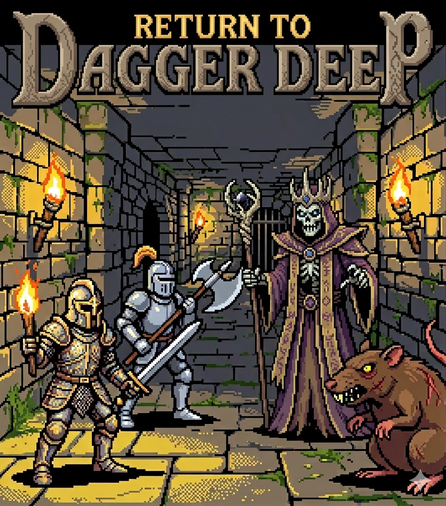

# Dagger Deep



A solo or two-player cooperative terminal roguelike built with Rust and Ratatui. Descend through ten dungeon levels, slay monsters, loot chests, and confront the undying Lich before it destroys you both.

Built with Claude Code as a fun project.
---

## Requirements

- A terminal at least **100 columns × 30 rows**
- Rust toolchain (stable) if building from source

---

## Building & Running

```bash
cargo build --release
./target/release/daggerdeep
```

Pre-built binaries for macOS ARM, Linux x64, and Windows x64 are available as GitHub Actions artifacts on each push to `main`.

---

## Controls

| Key | Action |
|-----|--------|
| `↑ ↓ ← →` | Move / attack adjacent monster |
| `Esc` | Open quit confirmation |
| `Y` / `Enter` | Confirm quit |
| `N` / `Esc` | Cancel quit |
| `+` (Shift =) | Skip to next level *(debug / testing)* |

Moving into a monster's tile attacks it. There is no separate attack key.

---

## Objective

Reach **level 10** and step onto the staircase (`>`) to win. The staircase only appears once every monster on the current level has been defeated.

---

## Dungeon Levels

The dungeon has **10 levels** of procedurally generated rooms and corridors. Each level is deeper and more dangerous than the last. Monster HP is scaled up in multiplayer (see below).

| Level | Notable event |
|-------|---------------|
| 1–8 | Standard rooms with Goblins, Mages, and Rats |
| 9 | 30% chance a Lich is present |
| 10 | 90% chance a Lich is present |

---

## Monsters

All monsters use a **d6 hit roll** — a roll of 1–3 misses, 4–6 hits. Damage is also rolled on a d6. Monsters move toward the nearest player each turn.

| Symbol | Name | HP (solo) | HP (multiplayer) | Damage | Special |
|--------|------|-----------|------------------|--------|---------|
| `G` (Blue) | Goblin | 8 | 12 | 1d6 | — |
| `M` (Red) | Mage | 12 | 18 | 1d6 | — |
| `R` (Cyan) | Rat | 5 | 8 | 1d6 | — |
| `L` (Magenta) | Lich | 40 | 60 | 2d6 | Teleports once; drops healing chest on death |

> In multiplayer, all monsters have **1.5× HP** and deal damage equal to the **higher of two d6 rolls** instead of one (except the Lich, which always deals 2d6).

### The Lich

The Lich is a boss-tier monster exclusive to levels 9 and 10. It hits harder than anything else in the dungeon (2–12 damage per hit) and has a special ability:

- **Teleport** — The first time the Lich's HP drops to **25% or below**, it vanishes to a random location on the level and skips its counter-attack for that turn. This happens only once per Lich.
- **Healing chest drop** — When the Lich is finally slain, it leaves behind a **magenta `$`** chest at its position. Opening it **fully restores all players** regardless of current HP.

---

## Player Hit Points

Both players start with **100 HP**. HP never resets between levels — bring as much as you can into each new floor.

### Gaining Maximum HP

Every time you **kill a monster**, your maximum HP permanently increases by 1 and you immediately recover 1 HP. Over a full run this can meaningfully increase your survivability.

### Taking Damage

When a monster hits you, your current HP is reduced. If HP reaches 0:

- **Single player / Player 1 (host)** — Game over.
- **Player 2 (client)** — Respawned at the start of the level with **half their maximum HP**. The game continues.

---

## Potions

Potions appear on the map as `P` (Green). Stepping on one **fully restores your HP** to your current maximum. They are consumed on pickup.

---

## Chests

Regular chests appear as `$` (Yellow). Each chest has one of three outcomes when opened:

| Outcome | Probability | Effect |
|---------|------------|--------|
| Food | 40% | Fully heals **all players** to their current maximum HP |
| Trap | 25% | Deals 1d6 damage to the player who opened it |
| Empty | 35% | Nothing |

### Lich Chest

When the Lich is defeated it drops a special **magenta `$`** chest. Unlike normal chests this always contains a full heal for every player present.

---

## Multiplayer

Dagger Deep supports **two-player cooperative** play over a local network (TCP).

### Hosting a Game

1. Select **[H] Host Game** from the main menu.
2. The game waits for Player 2 to connect on **port 4444**. Your local IP address is what Player 2 needs to enter.
3. Once Player 2 connects, the dungeon generates and both players begin on level 1.

### Joining a Game

1. Select **[J] Join Game** from the main menu.
2. Enter the **host's IP address** and press `Enter`. The game will try to connect for up to 5 seconds.

### Multiplayer Rules

- The **host** controls Player 1 (`@`, White) and acts as the authoritative game server.
- The **client** controls Player 2 (`&`, Cyan).
- Both players share the same dungeon, monster pool, and level progression.
- Stairs only appear once **all monsters** on the level are dead. Either player can descend.
- If Player 2 disconnects mid-game, Player 1 continues in **solo mode**.
- If Player 1 (host) disconnects, Player 2 **continues solo** using the last known dungeon state, taking over their character.

### Map Legend

| Symbol | Colour | Meaning |
|--------|--------|---------|
| `@` | White | Player 1 |
| `&` | Cyan | Player 2 |
| `G` | Blue | Goblin |
| `M` | Red | Mage |
| `R` | Cyan | Rat |
| `L` | Magenta | Lich |
| `P` | Green | Potion |
| `$` | Yellow | Chest |
| `$` | Magenta | Lich drop chest |
| `>` | Yellow | Stairs (next level) |
| `#` | Dark Gray | Wall |
| `.` | Dark Gray | Floor / Corridor |

---

## License

GPL
